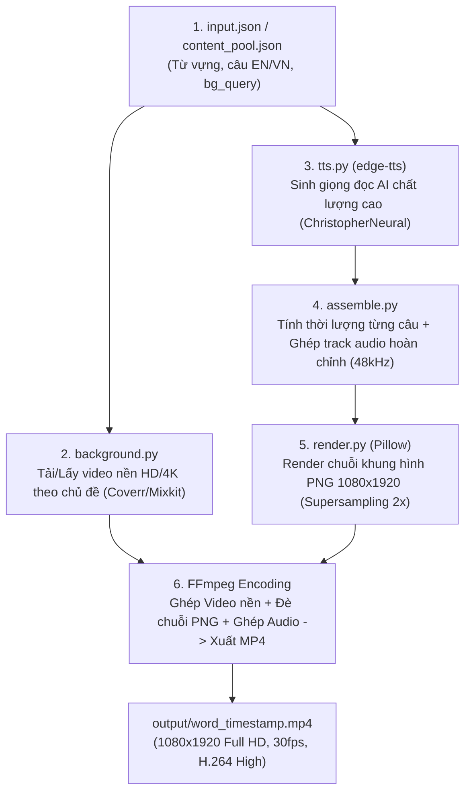

# TÀI LIỆU PHÂN TÍCH QUY TRÌNH, BỐ CỤC KHUNG HÌNH & GIẢI PHÁP NÂNG CẤP VIDEO

Tài liệu này mô tả chi tiết quy trình sản xuất video tự động từ mã nguồn, thông số bố cục hình ảnh - chuyển động hiện tại và danh sách các giải pháp tối ưu nhằm tăng tỷ lệ giữ chân người xem (Retention Rate) trên các nền tảng video ngắn (TikTok, YouTube Shorts, Facebook Reels).

---

## 1. TỔNG QUAN QUY TRÌNH TẠO VIDEO (PIPELINE)

Hệ thống hoạt động theo quy trình 5 bước tự động hóa khép kín:



### Chi tiết các bước kỹ thuật:

1. **Lấy Video nền (`generator/background.py`)**:
   - Dựa vào từ khóa `bg_query` (hoặc phân loại theo chủ đề: *coffee, nature, sunset, ocean, study, city, cozy, rain, space...*), hệ thống tải video stock chuẩn Full HD 1080p (từ Mixkit/Coverr) và cache vào `work/bg_1080p_<hash>.mp4`.
2. **Tạo giọng đọc AI (`generator/tts.py`)**:
   - Sử dụng Microsoft Edge TTS (`en-US-ChristopherNeural` - giọng nam trầm ấm) chuyển văn bản tiếng Anh thành các file `.mp3`, sau đó chuyển đổi sang chuẩn `.wav` PCM 16-bit 48000Hz stereo qua FFmpeg.
3. **Phân bổ Timeline (`main.py` + `generator/assemble.py`)**:
   - Đo thời lượng chính xác của từng câu nói TTS:
     $$\text{Thời lượng scene} = \max(\text{Thời lượng TTS} + 0.35s \text{ (đệm trước)} + 0.55s \text{ (đệm sau)}, 2.8s)$$
   - Thêm 1 scene Outro kết thúc có thời lượng cố định $2.2s$.
   - Ghép các đoạn audio vào đúng mốc thời gian trên timeline.
4. **Vẽ đồ họa khung hình (`generator/render.py`)**:
   - Render từng frame độc lập (30 fps) ở độ phân giải siêu nét **2160x3840 (Supersampling 2x)** rồi downscale bằng thuật toán **Lanczos** về **1080x1920** để chữ và viền kính mờ không bị răng cưa.
5. **Mã hóa & Ghép thành phẩm (`generator/assemble.py` - FFmpeg)**:
   - Scale & Crop video nền về tỷ lệ 9:16 (1080x1920 dọc).
   - Áp dụng bộ lọc màu điện ảnh: Giảm sáng nhẹ (`brightness=-0.05`), tăng tương phản (`contrast=1.08`), tăng độ rực màu (`saturation=1.12`) và làm nét (`unsharp=3:3:0.5:3:3:0.0`).
   - Ghép đè lớp đồ họa PNG, đồng bộ track âm thanh TTS, xuất file MP4 với chuẩn màu `BT.709`, `CRF 15`, `Preset slow` chất lượng cao.

---

## 2. CHI TIẾT BỐ CỤC KHUNG HÌNH (VISUAL LAYOUT)

Khung hình có tỷ lệ chuẩn **9:16 (1080 x 1920 px)**, chia thành 4 lớp đồ họa từ dưới lên trên:

```text
+-------------------------------------------------------------+  Y = 0px
|                                                             |
|                   [VÙNG AN TOÀN TRÊN: 420px]                 |
|             (Tránh thanh tìm kiếm, filter TikTok)            |
|                                                             |
|   +-----------------------------------------------------+   |  Y = 420px
|   |  +-----------------------------------------------+  |   |
|   |  |           [ BADGE: TIẾNG ANH GIAO TIẾP ]       |  |   |  Y = 468px (Pill bo tròn)
|   |  +-----------------------------------------------+  |   |
|   |                                                     |   |
|   |                                                     |   |
|   |                WHAT DOES IT MEAN                    |   |  Text EN: Trắng (#FFFFFF)
|   |               TO BE DETERMINED?                     |   |  Font: BeVietnamPro-ExtraBold (68px)
|   |                                                     |   |  Căn giữa + Drop shadow
|   |                                                     |   |
|   |               [Khoảng cách Gap = 50px]              |   |
|   |                                                     |   |
|   |                 Quyết tâm là gì?                    |   |  Text VN: Vàng cát (#E8C57A)
|   |                                                     |   |  Font: BeVietnamPro-SemiBold (46px)
|   |                                                     |   |
|   |       [ THẺ TỐI GLASSMORPHIC: 952 x 1080px ]        |   |
|   |   (Bo góc 44px, Nền đen mờ 65%, Viền sáng mỏng)     |   |
|   +-----------------------------------------------------+   |  Y = 1500px
|                                                             |
|                   [VÙNG AN TOÀN DƯỚI: 420px]                |
|             (Tránh Caption TikTok, Nút Like, Share)          |
|                                                             |
+-------------------------------------------------------------+  Y = 1920px
```

### Thông số kỹ thuật chi tiết từng phần tử:

| Thành phần | Vị trí / Kích thước | Màu sắc / Chất liệu | Kiểu chữ / Hiệu ứng |
|---|---|---|---|
| **Background Video** | $1080 \times 1920$ px | Video stock chuyển động chậm | Chỉnh màu Cinematic (BT.709, CRF 15) |
| **Glassmorphic Card** | $952 \times 1080$ px (Cách 2 mép $64$ px, $Y=420 \to 1500$ px) | Nền đen xanh than `rgba(10, 14, 22, 65%)`, viền `rgba(255, 255, 255, 18%)` | Bo góc $44$ px, viền dày $3$ px |
| **Top Badge** | $Y = 468$ px (Giữa thẻ) | Nền vàng `rgba(232, 197, 122, 14%)`, viền vàng mờ | Chữ `"TIẾNG ANH GIAO TIẾP"` (Bold 24px), bo góc $20$ px |
| **English Text** | Căn giữa Card | Trắng tinh `#FFFFFF` | `BeVietnamPro-ExtraBold` ($68$ px), Drop Shadow mờ $45\%$ |
| **Vietnamese Text** | Căn giữa Card (dưới text EN $50$ px) | Vàng cát `#E8C57A` / Vàng kem `#FFDA8C` | `BeVietnamPro-SemiBold` ($46$ px), tự động xuống dòng và fit size |
| **Motion Transition** | Toàn bộ Scene | Alpha Fade In/Out ($0.35$s / $0.30$s) | Trôi dọc nhẹ nhàng (Drift Y $24$ px từ dưới lên) |

---

## 3. ĐÁNH GIÁ ĐIỂM MẠNH & HẠN CHẾ HIỆN TẠI

### Điểm mạnh:
* Hình ảnh đồ họa và chữ siêu nét nhờ công nghệ **Supersampling 2x + Lanczos Resize**.
* Thiết kế đạt chuẩn **TikTok Safe Zone** (không bị che bởi thanh công cụ, bình luận hay caption).
* Đọc rõ 100% trên mọi nền video nhờ thẻ Glassmorphic làm mờ phía sau.

### Các hạn chế ảnh hưởng đến lượt xem / Tỷ lệ giữ chân (Retention Rate):
1. **Thiếu Hook kích thích trong 2 giây đầu**: Hiệu ứng Fade-in $0.35$s tương đối chậm rãi, dễ bị người dùng lướt qua.
2. **Thiếu Nhạc nền (BGM) & Âm thanh hiệu ứng (SFX)**: Video chỉ có giọng đọc thoại thô, giữa các câu có khoảng lặng (dead air).
3. **Phụ đề tĩnh theo khối (Static Block Subtitle)**: Cả câu tiếng Anh hiện cùng lúc, người xem đọc lướt xong dễ rời đi ngay trước khi giọng đọc dứt câu.
4. **Giọng đọc đơn điệu 1 người**: Một giọng nam đọc từ đầu đến cuối cả câu hỏi lẫn câu trả lời.
5. **Thiếu yếu tố kích thích tương tác (Call To Action & Gamification)**.

---

## 4. GIẢI PHÁP NÂNG CẤP TĂNG SỨC HÚT CHO VIDEO

### Giải pháp 1: Bổ sung Nhạc nền (BGM) & Sound Effects (SFX)
* **Nhạc nền Lofi Chill / Ambient**: Trộn 1 track nhạc không lời nhẹ nhàng ở âm lượng $15\% - 20\%$ phía dưới giọng đọc (tự động hạ âm lượng BGM khi có tiếng nói).
* **Hiệu ứng âm thanh (SFX)**:
  - Thêm tiếng *Whoosh / Swoosh* khi chuyển cảnh giữa các câu.
  - Thêm tiếng *Pop / Ding* khi xuất hiện từ khóa quan trọng hoặc câu trả lời.

### Giải pháp 2: Hiệu ứng chữ Karaoke Highlight (Word-by-Word Animation)
* Trích xuất mốc thời gian từng từ của `edge-tts` (Word Boundary Timestamps).
* Khi giọng AI đọc đến từ nào, từ đó sẽ **sáng rực màu vàng neon (#FFE600), phóng to nhẹ 110% hoặc có vệt màu highlight**.
* Đây là xu hướng giữ chân người xem hiệu quả nhất trên TikTok/Reels hiện nay (tăng Watch Time trung bình $40\% - 60\%$).

### Giải pháp 3: Visual Hook 2 giây đầu & Thanh tiến trình (Progress Bar)
* **Bouncy Pop-in**: Câu hỏi đầu tiên xuất hiện dạng nảy nhẹ (`scale 0.9 -> 1.05 -> 1.0`) trong $0.2$ giây đầu kèm âm thanh "Pop".
* **Thanh Progress Bar**: Một đường line phát sáng mảnh chạy dọc theo đáy thẻ để thể hiện tiến độ video, kích thích người xem nán lại xem hết câu trả lời.

### Giải pháp 4: Chế độ Hội thoại 2 Giọng đọc AI (Dual-Speaker Dialog)
* **Scene 1 (Câu hỏi)**: Sử dụng giọng nữ (`en-US-JennyNeural` hoặc `en-US-AriaNeural`).
* **Scene 2 & 3 (Câu trả lời/Quote)**: Sử dụng giọng nam (`en-US-ChristopherNeural` hoặc `en-US-GuyNeural`).
* Mô phỏng một cuộc phỏng vấn/đối thoại thực tế giữa 2 người, tạo cảm giác tự nhiên và cuốn hút hơn.

### Giải pháp 5: Gamification & Call To Action (CTA) ở Outro
* Thêm câu đố trắc nghiệm mini $3$ giây ở cuối video:
  > *"Từ đồng nghĩa của Determined là gì? A. Persistent | B. Hesitant (Comment đáp án nhé!)"*
* Kêu gọi hành động: *"Lưu lại để học mỗi ngày!"* hoặc *"Comment 'YES' nếu bạn thích câu nói này"*.
